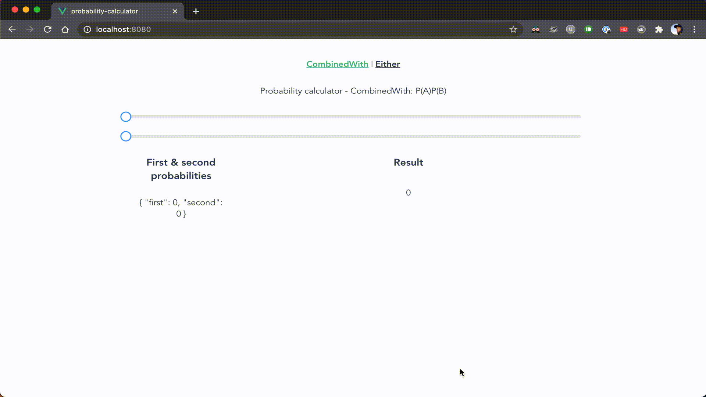

## How to run

- For the [frontend](./frontend/README.md)
- For the [backend](./backend/README.md)

# Project setup

This web app was designed to allow consultants (or any user) to enter probabilities to carry out basic calculations.

`element-ui` has a nice slider component which allows for customizing what values can be considered valid. Our use case is for both probabilities to be in the range from `0` to `1`. Any decimal number between this range is valid while the rest is not. e.g.

| Valid | Invalid |
| ----- | ------- |
| 0     | 2       |
| 1     | -1      |
| 0.5   | -0.5    |
| 0.99  | 1.1     |

Writing calculated data to a local file system as `info.log` is not really the best way to go about this, so a minimal Flask app was created as an API endpoint to consume payload retrieved from the frontend. (See [this post](https://stackoverflow.com/a/46467999/4477547) for more details).

## About the logging API

The API is fired on change events (i.e. when the slider is updated during user interaction). You can see this happening by opening a new terminal and run the command below to see the log being written

```
❯ cd path/to/your/folder/probability-calculator-backend
❯ tail -f logs/info.log

[3/24/2021, 4:18:32 PM] - type-of-calculation [either], inputs-received [{'first': 0.5, 'second': 0.6}], result [0.8]
[3/24/2021, 4:18:32 PM] - type-of-calculation [either], inputs-received [{'first': 0.5, 'second': 0.5}], result [0.8]
[3/24/2021, 4:18:32 PM] - type-of-calculation [either], inputs-received [{'first': 0.5, 'second': 0.5}], result [0.75]
```

<p align="center">
  
</p>
