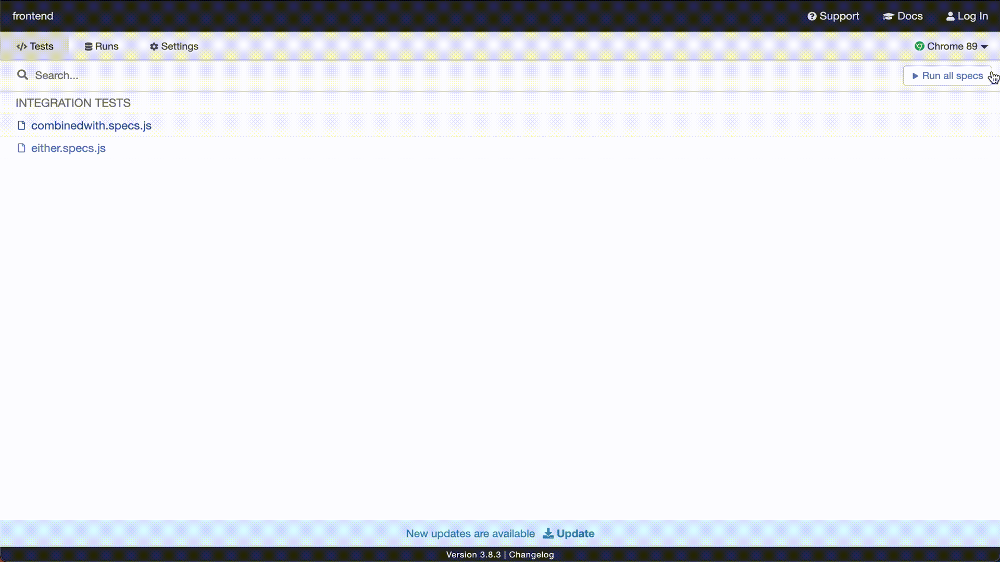

## About

A Vuex frontend that enables the user to enter 2 values to calculate the probability of:

1. CombinedWith: P(A)P(B) e.g. 0.5 \* 0.5 = 0.25
2. Either:P(A) + P(B) - P(A)P(B) e.g. 0.5 + 0.5 – 0.5 \* 0.5 = 0.75

### Compiles and hot-reloads for development

```
❯ cd frontend
❯ yarn && yarn serve
```

### Run your unit tests

```
❯ yarn test:unit
or
❯ yarn test:unit:wa
```

※ Appending `:wa` enables unit test to run automatically when files are changed. Mostly useful for making changes and testing on the fly.

### Run your end-to-end tests

```
❯ yarn test:e2e
```

Launches a seperate browser for testing. Which looks like below:

<p align="center">
  
</p>

## Design details

Built with vuex. One of the easiest ways we can capture probability data and calculate it is by taking advantage of the Redux like state management framework built into the library. Initially all probability data is set to 0 until interaction on the slider components have been triggered. Depending on the page the user is on (e.g. CombinedWith to calculate `a` \* `b`) their respective action methods are called.

These action methods call the calculation logic done on the mutation side that updates the value of their states. Then we are done and the initial getter will just display what the new values are after an update. As for logging, this is handled in a similar manner but this time we use `axios` to send a POST request to the backend for logging.
